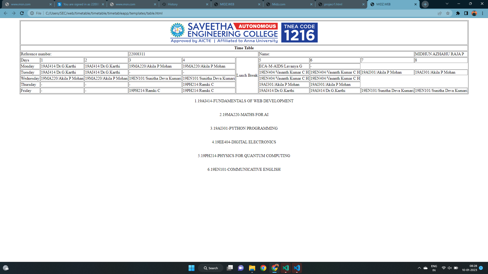

# EXPERIMENT -03
# TIMETABLE

## AIM :

To Write a html webpage page to display your timetable.

## ALGORITHM :

### STEP 1

create a simple table using table tag

### STEP 2

Add header row using th tag

### STEP 3

Add your timetable

### STEP 4

Execute the program

## CODE :
```
<!DOCTYPE html\>
<html lang="eng">
  </head>
  <title>MIDZ.WEB</title>
  </head>
  <body>
  <table border=1 align="center">
    <tr>
    <th colspan=10>Time Table</th>
   </tr>
    <tr>
       <td colspan=3>Reference number:</td>
       <td colspan=3>22008311</td>
       <td colspan=3>Name:</td>
       <td colspan=3>MIDHUN AZHAHU RAJA P</td>
    </tr>
    <tr>
       <td>Days</td>
       <td>1</td>
       <td>2</td>
       <td>3</td>
       <td>4</td>
       <td rowspan=6>Lunch Break</td>
       <td>5</td>
       <td>6</td>
       <td>7</td>
       <td>8</td>
    </tr>
    <tr>
       <td>Monday</td>
       <td>19AI414/Dr.G.Karthi</td>
       <td>19AI414/Dr.G.Karthi</td>
       <td>19MA220/Akila P Mohan</td>
       <td>19MA220/Akila P Mohan</td>
       <td>ECA-M-AIDS/Lavanya G</td>
       <td>-</td>
    </tr>
    <tr>
       <td>Tuesday</td>
       <td>19AI414/Dr.G.Karthi</td>
       <td>19AI414/Dr.G.Karthi</td>
       <td>-</td>
       <td>-</td>
       <td>19EN404/Vasanth Kumar C H </td>
       <td>19EN404/Vasanth Kumar C H</td>
       <td>19AI301/Akila P Mohan</td>
       <td>19AI301/Akila P Mohan</td>
    </tr>
    <tr>
       <td>Wednesday</td>
       <td>19MA220/Akila P Mohan</td>
       <td>19MA220/Akila P Mohan</td>
       <td>19EN101/Sunitha Deva Kumari</td>
       <td>19EN101/Sunitha Deva Kumari</td>
       <td>19EN404/Vasanth Kumar C H </td>
       <td>19EN404/Vasanth Kumar C H </td>
     </tr>
     <tr>
        <td>Thursday</td>
        <td>-</td>
        <td>-</td>
        <td>-</td>
        <td>19PH214/Ramki C</td>
        <td>19AI301/Akila P Mohan</td>
        <td>19AI301/Akila P Mohan</td>
     </tr>
     <tr>
        <td>Friday</td>
        <td>-</td>
        <td>-</td>
        <td>19PH214/Ramki C</td>
        <td>19PH214/Ramki C</td>
        <td>19AI414/Dr.G.Karthi</td>
        <td>19AI414/Dr.G.Karthi</td>
        <td>19EN101/Sunitha Deva Kumari</td>
        <td>19EN101/Sunitha Deva Kumari</td>
        
   </tr>
  </table>
  <br><center>1.19AI414-FUNDAMENTALS OF WEB DEVELOPMENT</center></br>
  <br><center>2.19MA220-MATHS FOR AI</center></br>
  <br><center>3.19AI301-PYTHON PROGRAMMING</center></br>
  <br><center>4.19EE404-DIGITAL ELECTRONICS</center></br>
  <br><center>5.19PH214-PHYSICS FOR QUANTUM COMPUTING</center></br>
  <br><center>6.19EN101-COMMUNICATIVE ENGLISH</center></br>
  

  </body>
  </html>
```
## OUPUT :

